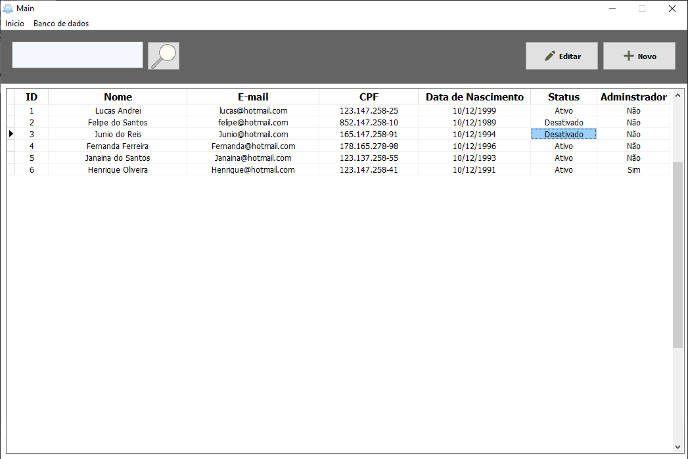
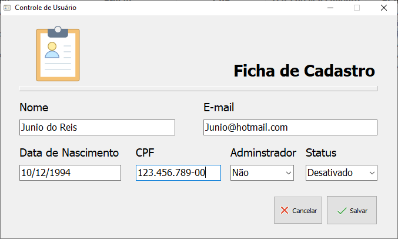

# Gerenciamento de Usuário
- Criar, alterar e editar usuários; 
- Listar usuários cadastrado no banco de dados;
- Realiza busca do usuário pelo nome.

## Bibliotecas Necessárias
| Biblioteca  | Link |
| ------------- | ------------- |
| Zeoslib  | [Sourceforge](https://sourceforge.net/projects/zeoslib/)  |

## Configuração do Zeoslib
Editar os componetes do `conexaoBanco` presente no Data Module `database`
```
Port = ''                       - Porta de conexão com o banco de dados
Protocol = ''                   - Protocolo de conexão (MySQL/Postgre)
LibraryLocation = ''            - Local da biblioteca do drive do banco de dados
user = ''                       - Usuário do banco de dados
Password = ''                   - Senha do banco de dados
```
- Script de geração do banco na pasta Database (MySQL/Postgre)
- Dll do MySQL/Postgre na pasta libs 

## Futuras Implementações:
- Salvar configuração do banco em um arquivo (MySQL ou Postgre);
- Alteração de banco de dados através do programa;  

## Imagens
> Tela inicial 

> Tela de gerenciamento 
